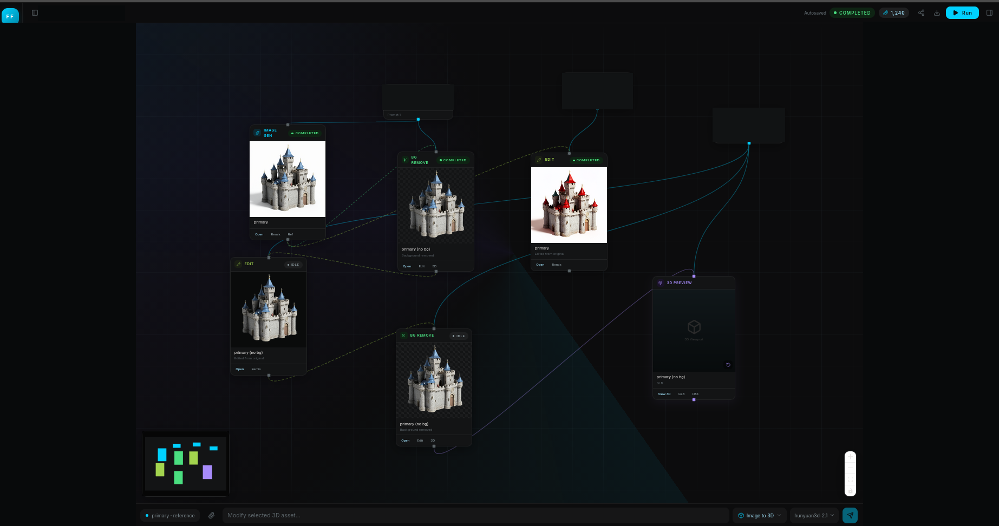
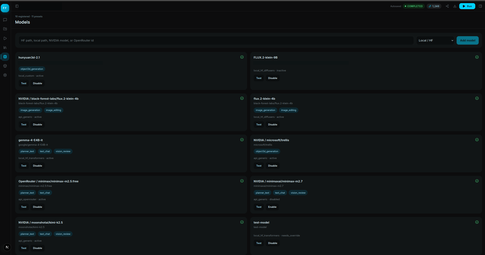

# ForgeFlow

ForgeFlow is a chat-first multimodal asset workspace for planning, generating, editing, reviewing, converting, and organizing visual assets. It pairs a fluid node-based Next.js interface with a FastAPI orchestration backend, provider registry, local inference adapters, hosted API adapters, and reusable shared UI/contracts packages.



## What It Does

- Chat-driven asset creation with persistent sessions and workspace history.
- Flow canvas that maps prompts, image generation, image editing, background removal, 3D conversion, and review outputs as connected nodes.
- Model registry with local and API-backed providers.
- Text-to-image and image editing via FLUX/Qwen/Z-Image style presets and registered providers.
- Image-to-3D conversion with GLB preview, export actions, and an interactive 3D viewer.
- Error handling that surfaces backend failures, provider errors, and CUDA/runtime problems in the UI instead of hiding them in logs.
- Provider panels, runs panel, library panel, model panel, 3D panel, and settings panel.

## Screenshots

### Workspace Flow


### 3D Viewer


### Model Registry



## Supported Model Presets

ForgeFlow separates catalog presets from registered runtime providers. Catalog entries can be shown in the UI, while registered providers are the actual execution targets.

| Model | Source | Capabilities | Notes |
| --- | --- | --- | --- |
| FLUX.2 klein 4B | Local HF Diffusers / NVIDIA | Image generation, image editing | 3090-friendly NF4 profile; supports source-image edits. |
| FLUX.2 klein 9B | Local HF Diffusers / API | Image generation, image editing | Higher quality profile; expects more VRAM/offload headroom. |
| Qwen Image 2.0 | Local HF Diffusers / API | Image generation, image editing | Unified generation/editing preset. |
| Qwen Image Edit 2511 | Local HF Diffusers / API | Image editing | Edit-focused preset. |
| Z-Image | Local HF Diffusers / API | Image generation | Efficient image generation preset. |
| Z-Image Edit | Local HF Diffusers / API | Image editing | Efficient instruction-guided edit preset. |
| Hunyuan3D 2.1 | Local custom | Object 3D generation | Converts image assets into GLB/OBJ-style outputs. |
| NVIDIA TRELLIS | NVIDIA Build | Object 3D generation | Hosted image-to-3D path when configured. |
| Kimi K2.5 | NVIDIA Build | Planner, chat, vision review | Default hosted planning/chat option when NVIDIA credentials exist. |
| MiniMax M2.5 | OpenRouter | Planner, chat | Hosted LLM fallback. |
| Gemma 4 E4B IT | Local HF Transformers | Planner, chat, vision review | Local VLM/planner option. |
| Qwen3 32B Instruct | Local HF Transformers | Planner, chat | Catalog preset for local LLM workflows. |
| DeepSeek R1 Distill Qwen 32B | Local HF Transformers | Planner, chat | Reasoning-oriented local preset. |
| GPT OSS 20B | Local HF Transformers | Planner, chat | Local chat/planning preset. |

## Repository Layout

| Path | Purpose |
| --- | --- |
| `apps/web` | Next.js workspace UI. |
| `services/api` | FastAPI backend, worker, provider registry, pipeline engine, and adapters. |
| `packages/contracts` | Shared TypeScript schemas and DTO types. |
| `packages/ui` | Shared React UI components and 3D review viewer surface. |
| `assets` | README/demo screenshots that are intentionally tracked. |

Runtime data, generated assets, SQLite DBs, temporary GLBs, browser test scratch files, `.run` logs, virtual environments, and build outputs are ignored.

## Setup

Install dependencies:

```bash
pnpm install

python3 -m venv services/api/.venv
source services/api/.venv/bin/activate
pip install -e "services/api[dev]"

cp .env.example .env
```

Configure only the providers you need:

```bash
NVIDIA_BUILD_API_KEY=...
OPENROUTER_API_KEY=...
HF_TOKEN=...
FORGEFLOW_DEFAULT_PROVIDER_STACK=local
```

## Running Locally

API on port `8888`:

```bash
cd services/api
.venv/bin/uvicorn forgeflow_api.main:app --app-dir src --host 127.0.0.1 --port 8888
```

Web on port `3333`:

```bash
NEXT_PUBLIC_FORGEFLOW_API=http://127.0.0.1:8888 pnpm --filter @forgeflow/web exec next dev -p 3333
```

Default URLs:

- Web: `http://127.0.0.1:3333`
- API health: `http://127.0.0.1:8888/health`

## Configuration

| Variable | Purpose |
| --- | --- |
| `NEXT_PUBLIC_FORGEFLOW_API` | Web app API base URL. |
| `FORGEFLOW_DEFAULT_PROVIDER_STACK` | `local` or `nvidia` default provider registration. |
| `NVIDIA_BUILD_API_KEY` / `NVIDIA_API_KEY` | NVIDIA Build credential. |
| `OPENROUTER_API_KEY` | OpenRouter credential. |
| `HF_TOKEN` | Hugging Face token for gated/private models. |
| `FORGEFLOW_FLUX_MODEL_PATH` | Local FLUX generation/editing model path or HF id. |
| `FORGEFLOW_FLUX_EDIT_MODEL_PATH` | Optional separate local FLUX edit model path. |
| `FORGEFLOW_FLUX_RUNTIME_PYTHON` | Python runtime used by the FLUX subprocess adapter. |
| `FORGEFLOW_HUNYUAN_ROOT` | Hunyuan3D root directory. |
| `FORGEFLOW_HUNYUAN_RUNTIME_PYTHON` | Python runtime used by Hunyuan3D. |
| `FORGEFLOW_NVIDIA_KIMI_MODEL` | NVIDIA planner/chat model override. |
| `FORGEFLOW_NVIDIA_IMAGE_MODEL` | NVIDIA image model override. |
| `FORGEFLOW_NVIDIA_3D_MODEL` | NVIDIA 3D model override. |
| `FORGEFLOW_OPENROUTER_MODEL` | OpenRouter text model override. |

## Verification

Frontend:

```bash
pnpm --filter @forgeflow/web test
pnpm --filter @forgeflow/web typecheck
pnpm --filter @forgeflow/ui test
```

Backend:

```bash
services/api/.venv/bin/pytest services/api/src/forgeflow_api/tests -q
```

## Notes

- Catalog entries are presets; registered providers are execution targets.
- FLUX.2 klein 4B is registered for both `image_generation` and `image_editing`.
- Image editing requires a selected source asset.
- Local image generation/editing shells out to the configured FLUX runtime so VRAM can be released between runs.
- Failed runs show a UI error popup with the backend error details.
